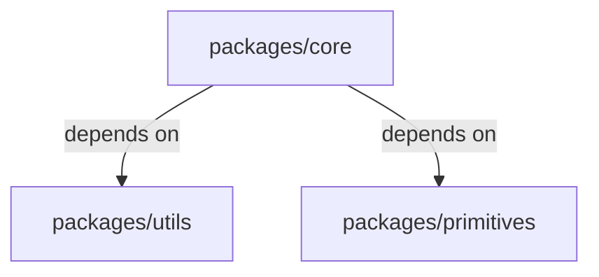

<div alt style="text-align: center; transform: scale(.5);">
  
</div>

> 💡 Currently in early alpha!

`lazyrepo` is a zero-config caching task runner for npm/pnpm/yarn monorepos.

It fits neatly into the slot that `turborepo` carved out: making `"scripts"` scale without adopting an industrial-strength build system like `nx`, `bazel`, `rush`, or `buck`.

`lazyrepo` is scary fast, a lot faster than `turborepo`. And this is despite being written in TypeScript instead of some young handsome clever funny systems language.

`lazyrepo` has a human-friendly config format, and the defaults are profoundly sensible. Best of all, it gives you helpful concise feedback so you can quickly debug when things aren't working quite how you'd expect.

Trust me, the whole situation is so delightful it will make you wish there was a `:chefs-kiss:` emoji.

## Installation

Install `lazyrepo` globally

    npm install lazyrepo --global

And also as a dev dependency in the root of your repo

    npm install lazyrepo --save-dev

And finally add `.lazy` to your .gitignore

    echo "\n\n#lazyrepo\n.lazy" >> .gitignore

## Basic Usage

Run tasks defined in your workspace packages' `"scripts"` using:

     lazy <script-name>

The default behavior is optimized for `"test"` scripts, where the order of execution matters if your packages depend on each other.

Let's say you have three packages: `core`, `utils`, and `primitives`. `core` depends on `utils` and `primitives` and they all have `"test"` scripts.



With no config, when you run `lazy test` in the project root:

- The tests for `utils` and `primitives` will begin concurrently. The tests for `core` will only be started if both `utils` and `primitives` finish successfully.
- If you change a source file in `core` and run `lazy test` again, only `core`'s tests will be executed.
- If you change a source file in `utils` and run `lazy test` again, both `utils` and `core`'s tests will be executed, in that order.

## Configuration

`lazyrepo` may be configured by creating a file called `lazy.config.js` or `lazy.config.json`

To create a `.js` config file, in your project root run:

    lazy :init

```ts
export default {
  tasks: {
    test: {
      cache: {
        // by default we consider all files in the package directory
        inputs: ['**/*'],
        // there are no outputs
        outputs: [],
        // a test invocation depends on the input files of any upstream packages
        inheritsInputFromDependencies: true,
      },
    },
  },
}
```

## Migrating from turborepo

TODO
