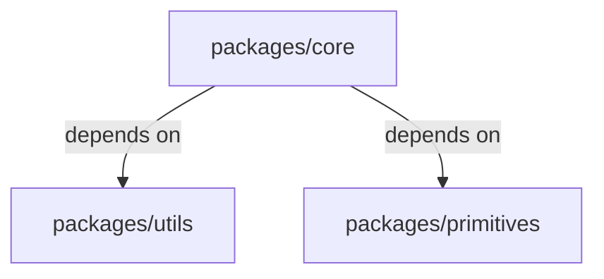

<div alt style="text-align: center; transform: scale(.5);">
  
</div>

> 💡 Currently in the prototyping stage, expect breaking changes! Get help or join in development on [discord](https://discord.gg/XWb3NGHkfD).

`lazyrepo` is a zero-config caching task runner for `npm`/`pnpm`/`yarn` monorepos.

It fits right into the niche that `turborepo` carved out: making package.json `"scripts"` scale without adopting a big industrial-strength build system like `nx`, `bazel`, `rush`, or `buck`.

`lazyrepo` is scary fast. It's a lot faster than `turborepo` despite being written in TypeScript rather than some young handsome clever funny systems language.

Aside from perf, `lazyrepo` comes with some big quality-of-life improvements:

- A human-friendly config format.
- Palpably sensible defaults.
- Concise and timely feedback to help you tweak and debug your build pipelines.
- You don't need to learn Rust to contribute.

Trust me, the whole situation is so delightful it will make you reach for the `:chefs-kiss:` emoji. And then you'll realize that there is no such emoji, but you'll want it so badly that you'll draft a proposal to the Unicode Consortium to lobby for its introduction.

## Installation

Install `lazyrepo` globally

    npm install lazyrepo --global

And also as a dev dependency in the root of your repo

    npm install lazyrepo --save-dev

And finally add `.lazy` to your .gitignore

    echo "\n\n#lazyrepo\n.lazy" >> .gitignore

## Basic Usage

### Running Tasks

Run tasks defined in `"scripts"` entries using:

    lazy <script-name>

You can pass arguments to the task script after a `--`

    lazy test -- --runInBand

The default behavior is optimized for `"test"` scripts, where the order of execution matters if your packages depend on each other.

Let's say you have three packages: `core`, `utils`, and `primitives`. The `core` package depends on both `utils` and `primitives`, and they all have `"test"` scripts in their package.json files.



With no config, when you run `lazy test` in the project root:

- The tests for `utils` and `primitives` will begin concurrently. The tests for `core` will only be started if both `utils` and `primitives` finish successfully.
- If you change a source file in `core` and run `lazy test` again, only `core`'s tests will be executed.
- If you change a source file in `utils` and run `lazy test` again, both `utils` and `core`'s tests will be executed, in that order.

### Other commands

- `lazy init`

  Creates a config file.

- `lazy clean`

  Deletes all local cache data.

- `lazy inherit`

  In larger projects, you often end up with the same `"script"` entries duplicated in lots of package.json files. Keeping them in sync can be troublesome.

  `lazyrepo` lets you specify the command just once.

  Replace the scripts entries with `lazy inherit`:

  ```diff
   "scripts": {
  -  "test": "jest --runInBand --noCache --coverage",
  +  "test": "lazy inherit"
   }
  ```

  Then add this in your lazy config file:

  ```diff
   "tasks": {
     "test": {
  +    "baseCommand": "jest --runInBand --noCache --coverage"
     }
   }
  ```

  Now when you run `npm test`, or whatever, in one of your package directories, it will look up the actual command to run from your lazy config file and run that.

- `lazy run <task> [-- <forward-args>]`

  Runs the given task, forwarding any args passed after the `--`

  You may filter the packages that a task should run in using the `--filter` option.

  e.g. to test only packages that end in `-utils`

      lazy run test --filter="packages/*-utils"

  You may force all tasks to execute by passing the `--force` option.

      lazy run test --force

## Configuration

Create a file called `lazy.config.js` or `lazy.config.json`

To create a `.js` config file, in your project root run:

    lazy init

```ts
export default {
  tasks: {
    test: {
      cache: {
        // by default we consider all files in the package directory
        inputs: ['**/*'],
        // there are no outputs
        outputs: [],
        // a test invocation depends on the input files of any upstream packages
        inheritsInputFromDependencies: true,
      },
    },
  },
}
```
